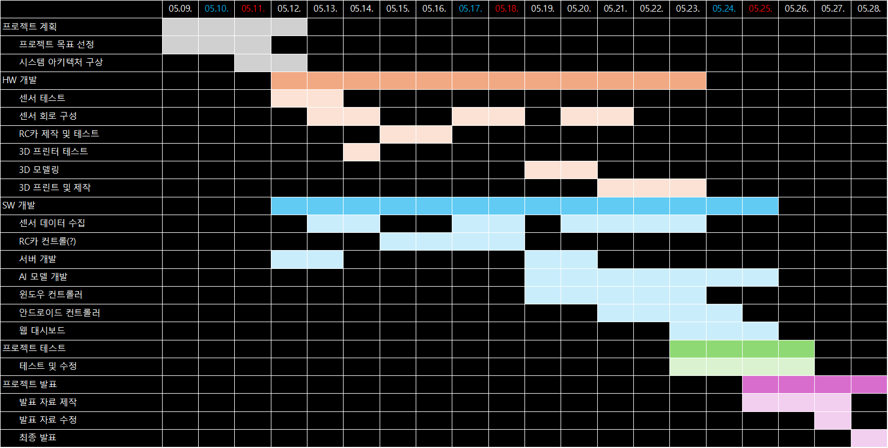
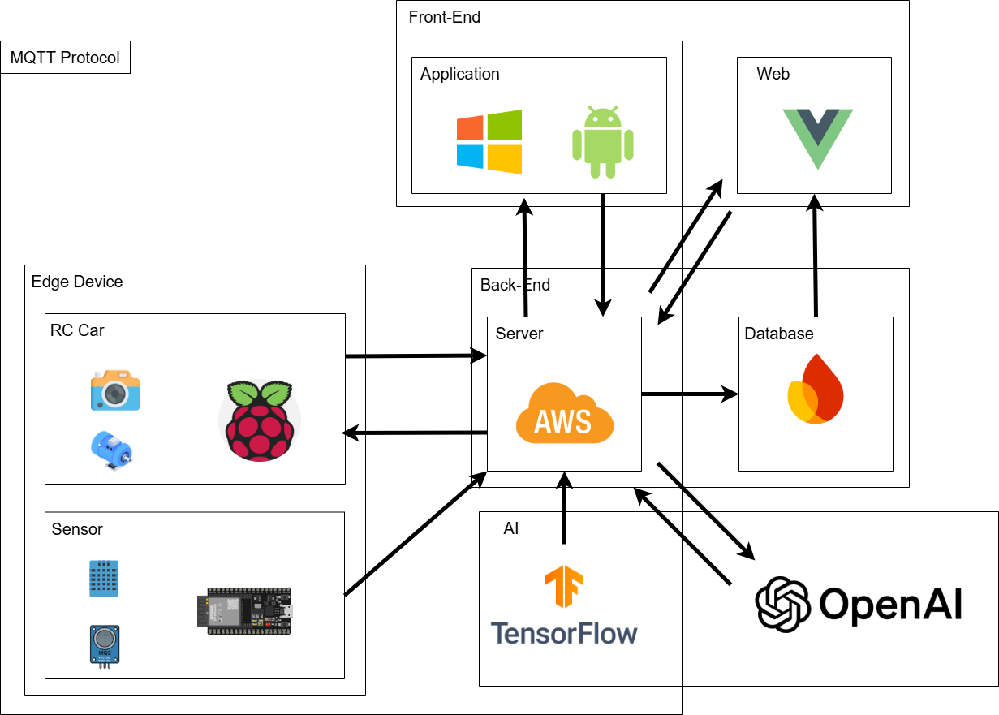
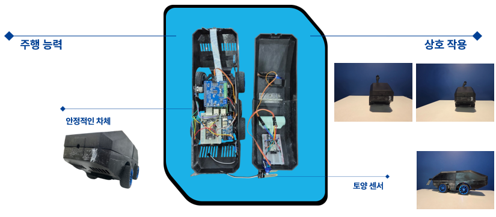
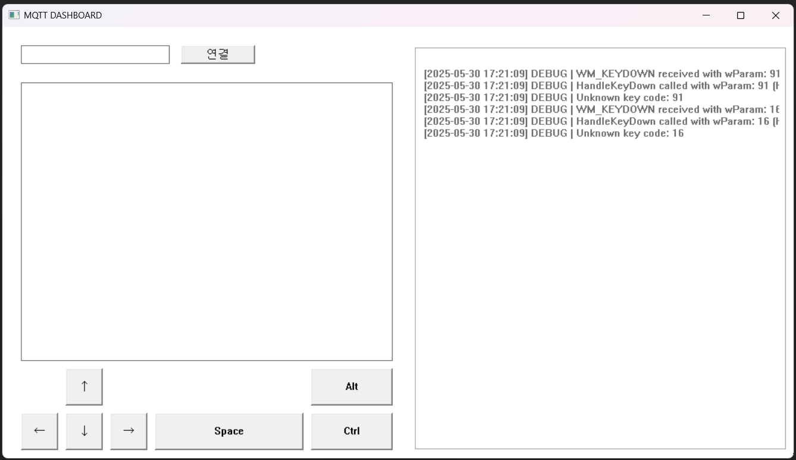
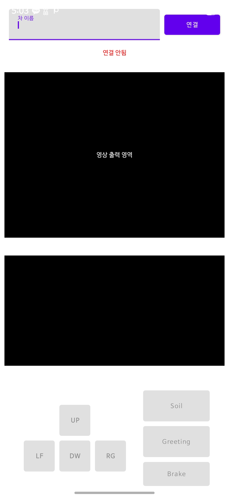
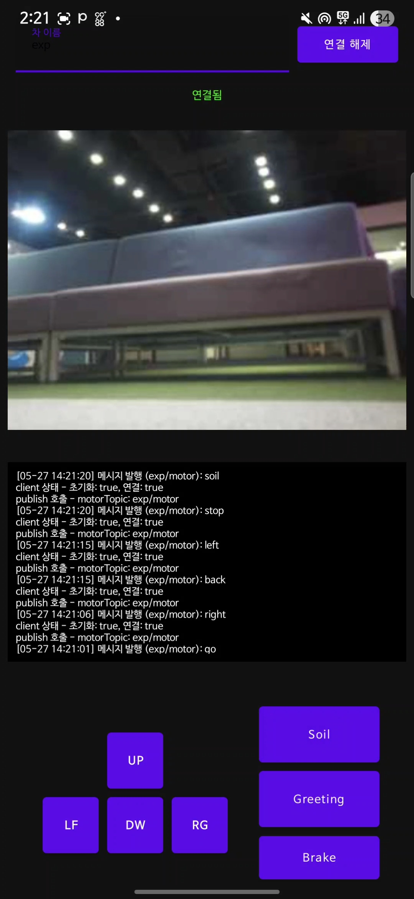
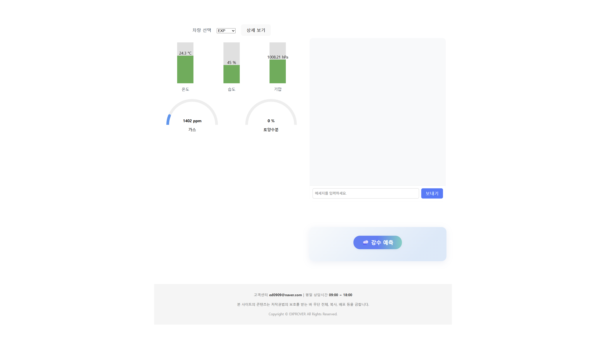
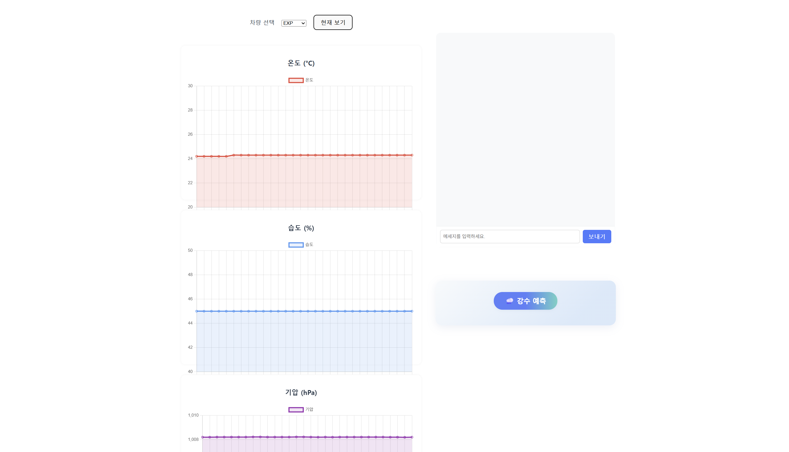
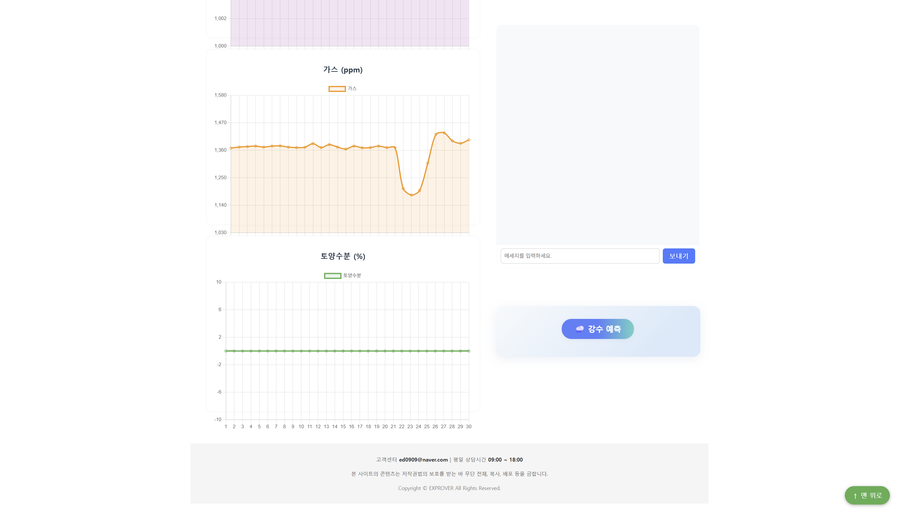
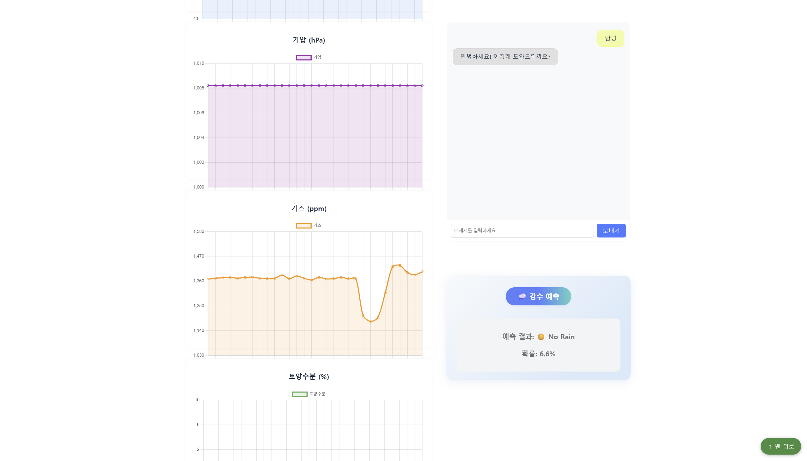

# 🔥 Exprover

## 📌 프로젝트 개요

Exprover는 인간이 접근하기 어려운 미지의 공간이나 위험 지역을 탐사하기 위한 탐사 로봇차입니다.

이 로봇은 다양한 센서와 AI 기술을 융합하여, 실시간 환경 모니터링과 데이터 분석, 그리고 원격 제어가 가능한 다기능 탐사 시스템을 목표로 합니다.

### 🎯 주요 역할

- 험난하거나 위험한 지형 및 환경에서 온·습도, 기압, 토양 상태, 가스 오염 등을 감지
- 수집된 데이터를 AI 모델을 통해 분석하여 해당 지역의 기상 및 환경 상태를 예측
- 영상 전송과 모터 제어를 통해 원격지에서 실시간으로 관찰 및 조작 가능
- AI 챗봇과의 대화 기능을 접목해 탐사 로봇으로서 정체성을 부여, 탐사 데이터에 대한 설명과 해석 가능

### 🤖 활용 시나리오

- 재난 지역 및 위험 지대의 초기 탐사 및 환경 모니터링
- 농업 및 환경 연구 분야에서 원격 토양 및 기후 데이터 수집
- 도시 외곽, 산악지대 등 접근이 어려운 곳의 실시간 관측 및 안전 관리

### 📅 프로젝트 일정

- 2025.05.09. ~ 2025.05.28.

## 🧰 상세 기능 및 구성 요소

### 1. 센서 시스템

- 온습도 센서 (DHT 등)
  - 실시간 온도와 습도 측정
  - 데이터를 1D CNN 기반 AI 모델에 입력하여 기상 예측 수행
- 기압 센서 (BMP280)
  - 기압 변화를 측정해 기상 변화 감지 및 분석
- 토양 수분 센서
  - 토양의 수분 함량 측정으로 토양 상태 및 수분 부족 여부 판단
  - 농업 환경 모니터링 가능
- 가스 센서 (MQ2)
  - 유해 가스 및 오염 물질 감지
  - 환경 오염 정도 실시간 체크

### 2. 모터 및 제어 시스템

- 다관절 모터를 이용한 로봇 손/팔 구현
- 원격 조작 앱(모바일/웹)과의 연동으로 실시간 조작 가능
- 안전성 고려한 움직임 제어 알고리즘 적용 예정

### 3. 영상 촬영 및 전송

- 로봇 전방 카메라 탑재
- 촬영된 영상을 10프레임 단위로 라즈베리파이4에서 실시간 전송
- 영상 데이터는 클라우드에 업로드되어 웹 대시보드 및 스마트폰 어플리케이션에서 확인 가능

### 4. AI 기반 데이터 분석 및 챗봇

- 기상 예측
  - 1D CNN 모델을 학습하여 수집된 센서 데이터를 기반으로 지역 날씨 예측
- AI 챗봇 ‘Exprover’
  - 탐사 과정에서 수집된 영상과 센서 데이터를 인식하여 사용자에게 설명 가능
  - 자연어 처리 기반 인터랙션으로 로봇과의 대화 지원
  - 추후 프롬프트 기반 학습으로 자율적 판단 및 탐사 임무 수행 강화 목표

### 5. 데이터 관리 및 웹 인터페이스

- AWS EC2 서버 및 Firebase를 활용한 데이터 저장 및 관리
- 센서 및 영상 데이터는 MQTT 프로토콜 기반 ESP32를 통해 전송
- 웹/모바일 앱에서 실시간 데이터 시각화 및 로봇 상태 모니터링 가능
- 사용자 편의성을 고려한 UI/UX 설계 적용용

## 🛠️ 기술 스택

### 🖼️ System Architecture

### 🤖 IoT Device

#### 보드 / 센서

#### 개발 환경

#### 언어 / 라이브러리

### 📱 Android Control App

#### 개발 환경

#### 언어 / 프레임워크

### 💻 Windows Control App

#### 개발 환경

#### 언어 / 라이브러리 / API

### 🌐 Web Dashboard

#### 개발 환경

#### 프레임워크 / 데이터베이스

### ☁️ 서버 / 인프라

### 📦 주요 라이브러리

### 🧩 기타 도구

## 🚗 결과

### 하드웨어

### 윈도우 어플리케이션

### 모바일 어플리케이션

### 웹 어플리케이션

### 시연 영상

- [주행 영상](https://youtu.be/_ABwtozIExY?si=L_oqzpjg9EXoQBDK)
- [상호작용 영상](https://youtube.com/shorts/jSPVlvpmOgc?si=_Xu4Z4C94L9g4LeX)
- [앱을 이용한 조작 영상]()
